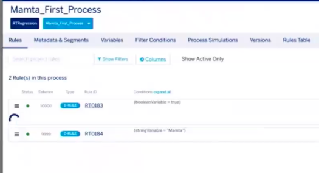

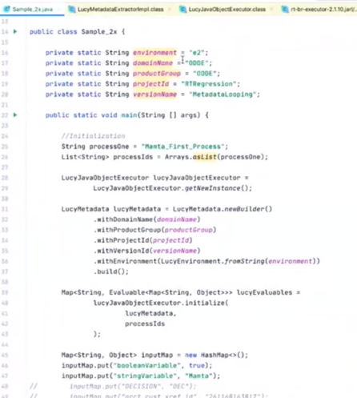

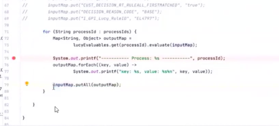

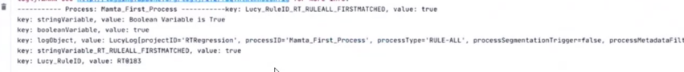

##Log Object
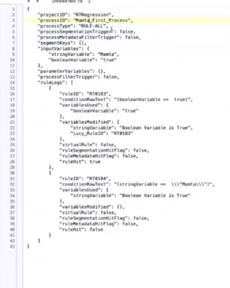

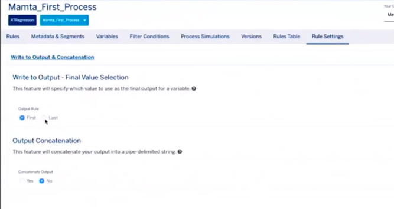

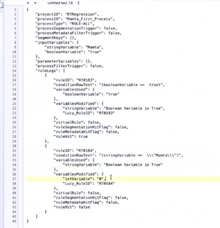

## want second rule to hit, what to do?
set first rule false
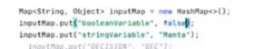

still not it last rule coz, first rule else condition set value to null

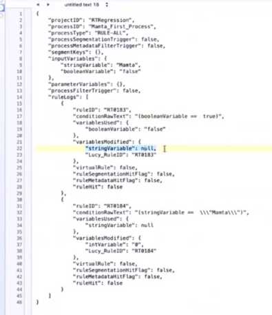

to make it work: leave it blank on failure. in enable derivation in consequences

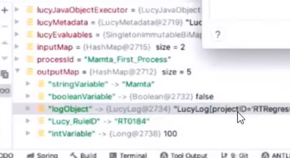

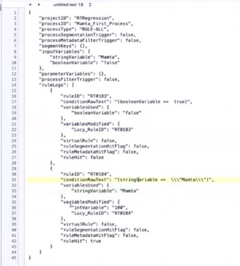

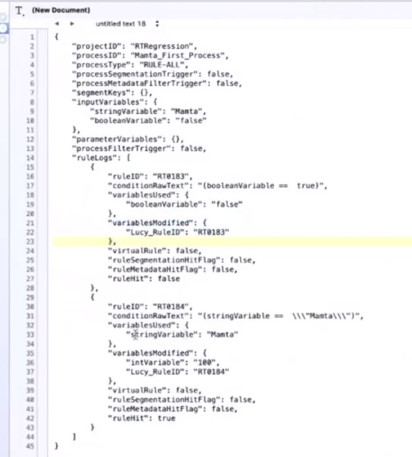